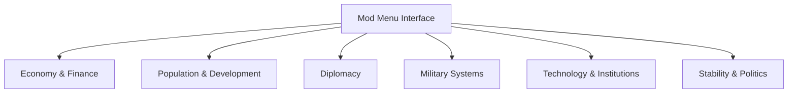

## Overview

Europa Universalis V Mod Menu is a runtime control interface designed to manage and adjust grand strategy systems at a systemic level. The **Europa Universalis V Mod Menu** framework exposes configurable parameters for national economy, population dynamics, diplomacy logic, warfare resolution, and internal stability mechanics. Operating without permanent modification of core data, the menu applies real-time overrides to simulation variables governing growth, influence, expansion, and state behavior. Secondary keywords integrated include strategy mod menu, nation management toolkit, economy controller, and diplomacy override system.

---

## National Economy and Finance Control

* Treasury value manipulation
* Income and expense scaling
* Inflation and corruption adjustment
* Loan and interest override

**Feature intent:**
Overrides fiscal simulation variables to regulate cash flow, long-term economic pressure, and financial stability.

---

## Population, Culture, and Development Systems

* Population growth rate control
* Cultural acceptance adjustment
* Province development scaling
* Migration and assimilation tuning

**In-game behavior:**
Modifies demographic calculations that influence manpower, production output, and unrest generation.

---

## Diplomacy and Influence Management

* Diplomatic power manipulation
* Opinion value override
* Alliance and rivalry condition bypass
* Treaty duration and effect control

**Feature intent:**
Provides direct influence over diplomatic validation logic and international relationship thresholds.

---

## Warfare and Military Resolution Layer

* Army and navy morale lock
* Discipline and combat width scaling
* Attrition and reinforcement override
* Siege progress manipulation

**In-game behavior:**
Alters combat resolution and campaign pacing by modifying morale checks, losses, and siege calculations.

---

## Technology, Ideas, and Institution Control

* Technology cost adjustment
* Instant idea group unlocks
* Institution spread acceleration
* Penalty bypass for tech lag

**Feature intent:**
Manages progression systems tied to innovation, modernization, and long-term national efficiency.

---

## Stability, Legitimacy, and Internal Politics

* Stability value lock
* Legitimacy and authority control
* Faction and estate influence tuning
* Revolt risk suppression

**In-game behavior:**
Overrides internal governance checks that affect rebellion, reforms, and political cohesion.

---

## Mod Menu Interface and Feature Orchestration

* Categorized system modules
* Toggle-based activation
* Real-time value adjustment
* Session-scoped configuration

**Feature intent:**
Acts as the central coordination layer, synchronizing all strategic subsystems and applying changes dynamically during gameplay.

---

## System Architecture Diagram

---

## FAQ

**Does the mod menu change save files permanently?**
No, all modifications are applied at runtime.

**Can individual systems be controlled independently?**
Yes, each strategic module can be enabled or disabled separately.

**Are changes reflected immediately in-game?**
Most values update in real time without requiring reloads.

**Does it affect AI nations as well?**
Controls can be applied globally or scoped to selected entities.

**Is progression control reversible?**
Disabling features restores default simulation behavior.

**Does the menu support presets?**
Session-based configurations are supported.

---

## Feature Summary

* National economy and finance control
* Population, culture, and development systems
* Diplomacy and influence management
* Warfare and military resolution layer
* Technology, ideas, and institution control
* Stability, legitimacy, and internal politics
* Centralized Europa Universalis V mod menu interface
